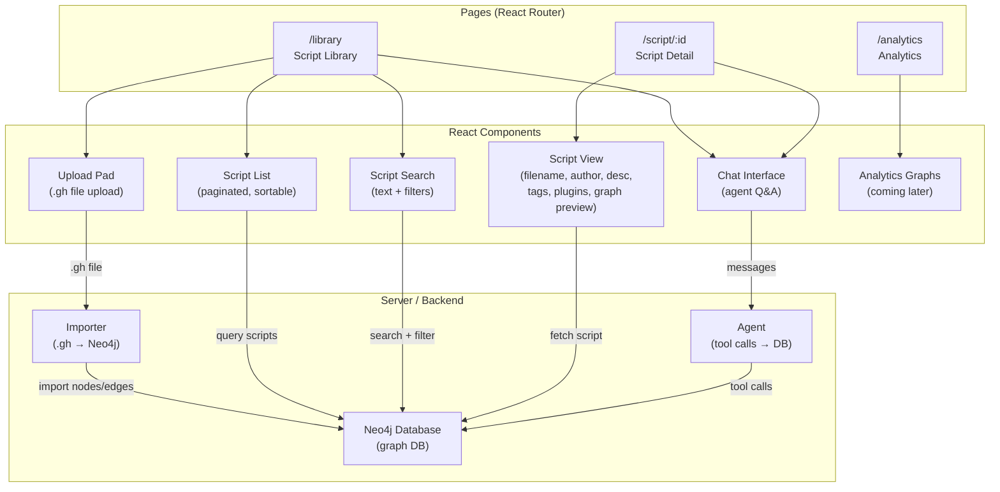

```mermaid
graph TD
    subgraph Pages["Pages (React Router)"]
        LIB["/library<br/>Script Library"]
        SCRIPT["/script/:id<br/>Script Detail"]
        ANALYTICS["/analytics<br/>Analytics"]
    end

    subgraph UI["React Components"]
        SL["Script List<br/>(paginated, sortable)"]
        SS["Script Search<br/>(text + filters)"]
        UP["Upload Pad<br/>(.gh file upload)"]
        SV["Script View<br/>(filename, author, desc,<br/>tags, plugins, graph preview)"]
        CI["Chat Interface<br/>(agent Q&A)"]
        AG["Analytics Graphs<br/>(coming later)"]
    end

    subgraph Server["Server / Backend"]
        DB["Neo4j Database<br/>(graph DB)"]
        IMP["Importer<br/>(.gh → Neo4j)"]
        AGENT["Agent<br/>(tool calls → DB)"]
    end

    LIB --> SL
    LIB --> SS
    LIB --> UP
    LIB --> CI

    SCRIPT --> SV
    SCRIPT --> CI

    ANALYTICS --> AG

    UP -->|".gh file"| IMP
    IMP -->|"import nodes/edges"| DB

    SL -->|"query scripts"| DB
    SS -->|"search + filter"| DB
    SV -->|"fetch script"| DB

    AGENT -->|"tool calls"| DB
    CI -->|"messages"| AGENT
```